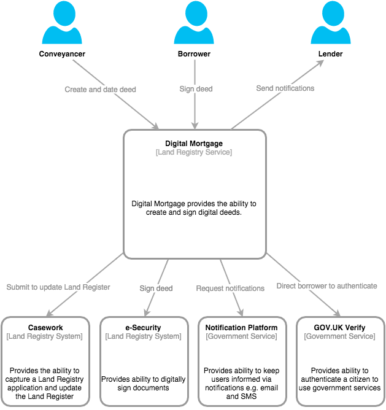
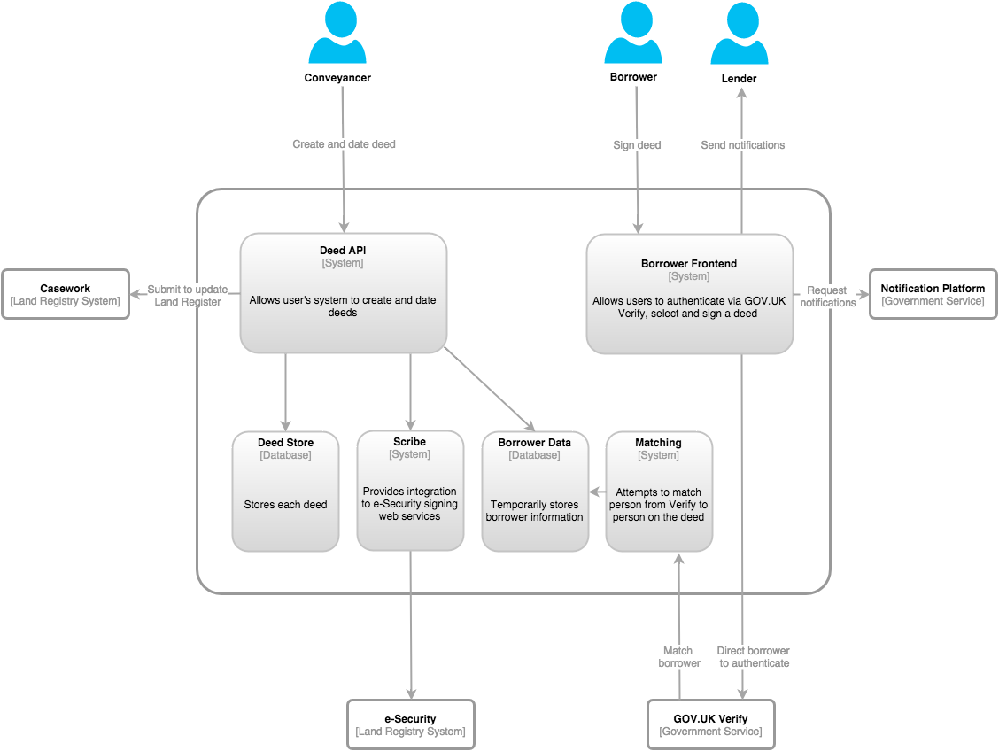

# Digital Mortgage Service

At a high level, Digital Mortgage is a service that provides the ability to create and digitally sign a digital deed. With regards to architecture, the diagram below puts in context who the users are and what the Digital Mortgage service is dependent upon.

Users
======

As you can see there are three users: borrowers, conveyancers and lenders.

**Conveyancers**

Working on behalf of the lender, conveyancers are in direct communication with the borrower. Using information supplied by the lender and the borrower, they will create the digital deed, initiate the signing process with the borrower, date the deed and submit it to Land Registry for registration.

**Borrowers**

Borrowers will agree a mortgage product with the lender, and liaise with conveyancer to provide information that is fed into deed creation. Then they will digitally sign the deed.

**Lenders**

Lenders agree a mortgage product with the borrower and liaise with conveyancers to initiate deed creation.

Dependencies
======

There are four potential dependencies: casework, e-Security, notifications platform and GOV.UK Verify.

**Casework**

Once a deed is signed and dated we then need to update the Land Register. Digital Mortgage will use casework to do that. In this context by casework I mean the systems that will capture a Land Registry application and update the Land Register accordingly. This includes both automated and manual systems, and therefore people too.

**e-Security**

e-Security is the system that will actually digitally sign the deed. It was created by IBM and Entrust.

**Notification Platform**

The Notification Platform is a central government service that is currently being built that will provide functionality to keep users informed by sending notifications to them.

**GOV.UK Verify**

GOV.UK Verify provides the ability to authenticate citizens to use government services.

Some Detail
======

In order to understand the customer journey we need to go into more detail about what we need to build for Digital Mortgage.

In the diagram above the two significant systems are the public facings ones: Deed API and Borrower Frontend.

**Deed API**

This system is the public facing, machine to machine interface that allows conveyancers via their casework management systems (CMS) to create and date deeds.

**Borrower Frontend**

This system is a visual service on GOV.UK that will allow a borrower to sign a deed.

Minimum Viable Product (MVP)
======

Both pictures above represent a strategic view of the service, however, given the time constraints the question becomes what is the minimum viable product?

Each dependency comes with various options or alternatives. However, we believe the minimum viable product would mean the following things:

* Do not integrate with the Notifications Platform but implement our own notifications instead. This reduces risk by removing a dependency on a third party.
* Use e-Security as is.
* Aim to integrate with Verify but investigate other alternatives. An alternative we are pursuing is to only implement two-factor authentication for the borrower before allowing them to sign a deed (i.e. no Verify). This has not yet been established as a valid alternative for the service.
* There is currently another team building a new casework system to capture and  process applications from the Digital Mortgage service. However for MVP, we have decided initially to have the conveyancer use Business Gateway EDRS to submit the application, so that it can be processed by existing systems. Our hope is that we will not have to change EDRS to accommodate this, however, that is looking increasingly unlikely. Having said that we are looking to keep the changes to a minimum. There are several positives to using EDRS but it is important to point out that by using EDRS there will be no auto-processing of the Digital Mortgage applications.

Customer Journey for MVP
======

To see how the users, Digital Mortgage and dependencies interact and flow together I will walk through a happy path MVP customer journey. NOTE: I have assumed we have integrated with Verify in this flow.

1. Borrower and lender agree a mortgage product.
2. Lender liaises with a conveyancer to initiate deed creation.
3. Conveyancer liaises with borrower.
4. Conveyancer uses their CMS to interact with the *Deed API* to create a deed.
5. *Deed API* stores the deed data.
6. Conveyancer directs the Borrower to sign the deed.
7. Borrower accesses the *Borrower Frontend*
8. *Borrower Frontend* redirects borrower to authenticate with *GOV.UK Verify*
9. After *GOV.UK Verify* authenticates the borrower it checks with Land Registry to make sure the borrower matches to the deed information.
10. After matching succeeds the *Borrower Frontend* presents the deed to the borrower to be signed.
11. Borrower uses *Borrower Frontend* to sign the deed.
12. *Borrower Frontend* asks *Deed API* to sign the deed.
13. *Deed API* via *Scribe* asks *e-Security* to sign the deed.
14. *Deed API* sends confirmation to *Borrower Frontend*
15. *Borrower Frontend* notifies both the conveyancer and lender.
16. Conveyancer uses their CMS to interact with the *Deed API* to date the deed.
17. *Deed API* adds new deed to legacy deed database.
18. Conveyancer submits case to EDRS.
19. EDRS captures and allocates the application to a caseworker, who completes the case.
